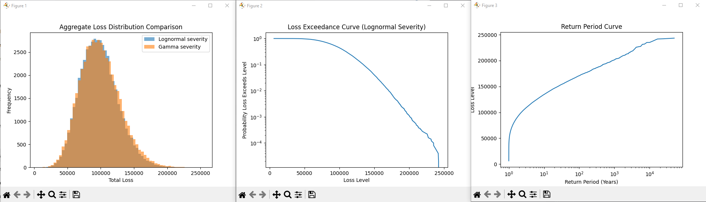

# Insurance Loss Simulation (Frequency–Severity Model)

This project simulates aggregate annual insurance losses for a generic portfolio using a Monte Carlo frequency–severity model.

Claim counts are modeled using a Poisson distribution and claim severities are modeled using lognormal and gamma distributions. The model simulates thousands of possible years of losses and analyzes the distribution of outcomes.

The goal is to demonstrate how actuaries model insurance portfolio risk and evaluate tail risk using simulation.

## Model Structure

Frequency Model  
N ~ Poisson(λ)

Severity Model  
X ~ Lognormal(μ, σ)  
X ~ Gamma(k, θ)

Aggregate Loss  
S = sum of claim severities

Each simulation represents one possible year of losses for the portfolio.

## Model Features

The simulation includes:

- Monte Carlo simulation of aggregate losses
- Poisson claim frequency model
- Lognormal and Gamma severity distributions
- Policy limits on individual claims
- Excess-of-loss reinsurance layer
- Value-at-Risk (VaR) risk metrics
- Probability of exceedance calculations
- Loss exceedance curve visualization
- Return period curve for extreme loss analysis
## Key Findings

Expected annual loss ≈ $98,000

95th percentile loss ≈ $147,000  
99th percentile loss ≈ $170,000  

Probability annual losses exceed $200,000 ≈ 0.11%.

The addition of policy limits significantly reduces the probability of extreme losses.

## Example Output

## How to Run

Install dependencies:

pip install -r requirements.txt

Run the simulation:

python loss_simulation.py
